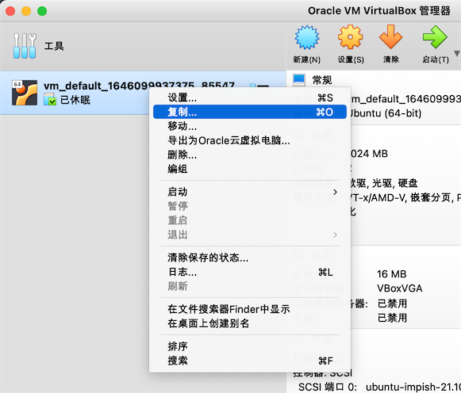
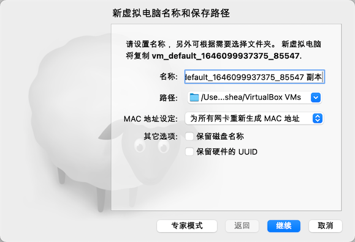
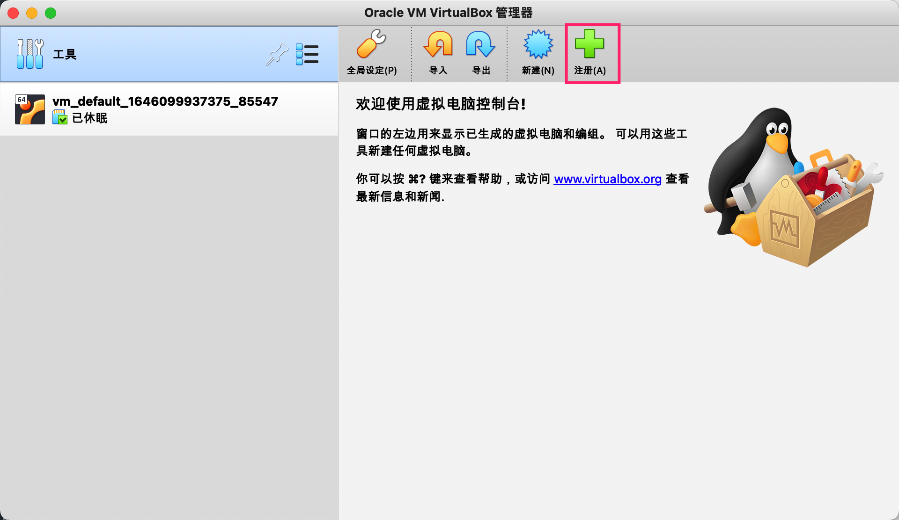

## 背景

手边有几台闲置的 Windows 台式机，于是准备充分利用一下这些闲置的计算资源，使用 kubeadm 搭建一个最新版本的 k8s 集群用于自己学习和研究。

这几台 PC 在一个局域网内可以互相连同和访问公网，但没有公网 IP。其配置如下，PC 1 用来作主节点，其他两台作为工作节点。

|      | OS       | 配置    | IP           | VM 配置 | VM IP        | VM Hostname |
|:----:| ---------- |:-----:|:------------:|:-----:|:------------:|:------------:|
| PC 1 | Win 10 | 4核8G  | 192.168.2.38 | 2核4G  | 192.168.2.80 | master       |
| PC 2 | Win 10 | 4核24G | 192.168.2.24 | 3核16G | 192.168.2.84 | worker-4c16g |
| PC 3 | Win 10 | 4核16G | 192.168.2.51 | 3核8G  | 192.168.2.81 | k8s-worker   |

## 准备

首先在所有 PC 上安装好 [VirtualBox](https://www.virtualbox.org/wiki/Downloads)，在 PC 1（主节点）上下载好 [Ubuntu Server 20.04](https://ubuntu.com/download/server) 的镜像，安装虚拟机，具体过程可参考[这里](https://github.com/cncamp/101/blob/master/k8s-install/k8s-by-kubeadm/install-ubuntu-on-virtualbox.pdf)，其中有几个需要注意的地方：

- 确保虚拟机分配的 CPU 数量大于 2 但小于宿主机实际的 CPU 数量，否则 kubeadm 初始化的时候会报错

- 30G 硬盘，4G 以上内存

- 安装过程会有个安装软件/工具的页面，除了 OpenSSH Server 以外**其他都不安装**，**特别是 Docker，不要勾选安装**（因为会使用 [snap](https://cn.ubuntu.com/blog/what-is-snap-application) 进行安装导致 kubelet 检测不到 Docker 服务）

## 主节点

首先在主节点安装好所需的软件，然后再将该虚拟机复制到其他 PC 上，从而省去重复安装和配置的过程。

```shell
# 设置 hostname，用于区分不同的虚拟机
sudo hostnamectl set-hostname master --static
```

### 软件安装

使用阿里云的镜像仓库，避免因网络问题无法拉取镜像。

#### Docker

```shell
curl -fsSL https://get.docker.com | sudo sh -s -- --mirror Aliyun
sudo usermod -aG docker $USER
sudo mkdir -p /etc/docker
sudo tee /etc/docker/daemon.json <<-'EOF'
{
  "exec-opts": ["native.cgroupdriver=systemd"],
  "log-driver": "json-file",
  "log-opts": {
    "max-size": "100m"
  },
  "storage-driver": "overlay2",
  "registry-mirrors": ["https://bdbdr6uo.mirror.aliyuncs.com"]
}
EOF
sudo systemctl daemon-reload
sudo systemctl restart docker
```

#### K8s

```bash
# 添加并信任APT证书
curl https://mirrors.aliyun.com/kubernetes/apt/doc/apt-key.gpg | sudo apt-key add -

# 添加源地址
add-apt-repository "deb https://mirrors.aliyun.com/kubernetes/apt/ kubernetes-xenial main"

sudo apt update && apt install -y kubelet kubeadm kubectl
```

### 复制虚拟机

在 VitrualBox 界面将虚拟机关机后，右键复制，选择保存的路径，需要注意：

- **设置重新生成 MAC 地址**

- 不保留硬件 UUID

- 完全复制




然后通过 U 盘或移动硬盘将复制的虚拟机拷贝到另外两台电脑上，打开 VirtualBox，点击注册，选择复制的虚拟机文件。



## 网络配置

在虚拟机关机状态下，在虚拟机设置中将网络设置为**桥接网络**，相当于在局域网中虚拟出一台新主机，然后启动虚拟机，**切换到 root 用户，接下来的操作都用 root 进行操作**。

通过命令`vim /etc/netplan/00-installer-config.yaml`配置静态 IP 地址：

```yaml
network:
  ethernets:
    enp0s3:
      dhcp4: false # 关闭动态分配 IP
      addresses: [192.168.2.81/24] # 设置一个和宿主机同网段的 IP，并确保该 IP 未被占用
      gateway4: 192.168.2.1 # 与宿主机一致
      nameservers:
              addresses: [8.8.8.8, 8.8.4.4] # 与宿主机一致
  version: 2
```

修改完成后保存，执行：`netplan apply`，然后测试虚拟机之间是否能够 ping 通以及访问外网。

## 集群初始化

在主节点上，以 root 用户执行：

```bash
kubeadm init --image-repository='registry.cn-hangzhou.aliyuncs.com/google_containers'

# 安装网络插件
kubectl apply -f "https://cloud.weave.works/k8s/net?k8s-version=$(kubectl version | base64 | tr -d '\n')"
```

`kubeadm init`成功后会显示类似信息，复制用于工作节点加入集群：

```bash
kubeadm join 192.168.2.80:6443 --token szeip3.tm5ji5ajpa6xfk64 \
        --discovery-token-ca-cert-hash sha256:f256bb87bb7d80eca7e620562a1adcbadbdc0ecd799da659403d193cb3dc3037
```

其中的 token 24 小时后过期，过期后可通过`kubeadm token create --print-join-command`再次获取上面的信息。

在工作节点以 root 执行前面复制的 `kubeadm join` 命令即可加入集群。

在主节点上查看节点：

```bash
export KUBECONFIG=/etc/kubernetes/admin.conf
kubectl get nodes
```

应该可以看到三个节点，且都是`Ready`状态，然后只有主节点有 role 字段，两个工作节点没有，可以通过以下命令来设置：

```bash
kubectl label node <node name> node-role.kubernetes.io/worker=worker
```

使用`kubectl get pod -n kube-system`查看核心组件的运行情况。

## SSH 配置（可选）

为了便于 SSH 到各 k8s 节点上，可以进行以下配置：

### 免密码登陆

在各虚拟机上通过`sudo vim /etc/ssh/sshd_config`编辑 sshd 的配置文件，允许 root 登陆和使用公钥认证:

```
PermitRootLogin yes
PubkeyAuthentication yes
```

保存后重启 sshd 服务：`service sshd restart`

在个人 PC 上：

```bash
# 将公钥复制到虚拟机上
scp ~/.ssh/id_rsa.pub root@192.168.2.81:~/.ssh/
```

在虚拟机上：

```
cat ~/.ssh/id_rsa.pub >> authorized_keys
```

### 快捷连接

在个人 PC 上给 ssh 的虚拟机设置别名，从而实现执行`ssh master`就能连接虚拟机，而无需记忆 IP 地址：

```
vim ~/.ssh/config

Host master
    user root
    hostname 192.168.2.80
    port 22
    IdentityFile /Users/hoshea/.ssh/id_rsa

Host worker1
    user root
    hostname 192.168.2.84
    port 22
    IdentityFile /Users/hoshea/.ssh/id_rsa

Host worker2
    user root
    hostname 192.168.2.81
    port 22
    IdentityFile /Users/hoshea/.ssh/id_rsa
```

## 参考

- [k8s 国内源安装备忘清单 · Issue #212 · islishude/blog · GitHub](https://github.com/islishude/blog/issues/212)
