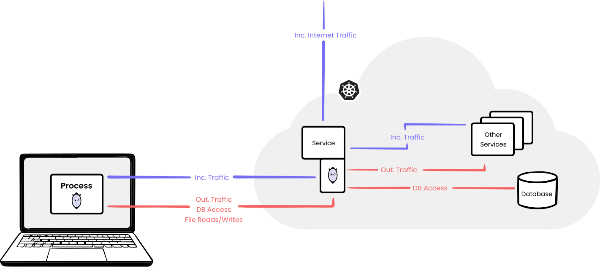

## 前言

最近在开发测试时，频繁使用到 [mirrord](https://mirrord.dev/) 这个工具，从最初的惊喜到遇到各种坑，再到逐渐掌握，深感这是一个能够显著提升开发效率的神器。因此写下这篇文章分享一下自己的使用经验，希望能对做云原生开发的朋友有所帮助。

### 云原生开发的痛点

在云原生开发中，存在着以下痛点：

1. 本地开发环境难以完整模拟云环境（比如调用其他服务，使用云环境的权限等），导致实际上线后出问题。
2. 反馈链路长，调试困难。每次修改代码后，需要经历 **构建镜像 -> 推送仓库 -> 部署对应 K8s 资源 -> 等待 Pod 启动 -> 查看日志** 的漫长过程。如果发现了问题，需要重复这个过程，开发效率低下。

而 mirrord 正是为解决这些问题而生的，它的核心能力是：**在本地运行代码，但在云环境的上下文中执行**。

## Mirrord 简介

Mirrord 是一个开源项目，它通过**进程级注入**，让本地进程仿佛直接“寄生”在 K8s 的 Pod 中，共享其网络、文件系统和环境变量。借助 mirrord，可以做到:

1. **本地运行代码,云端测试效果**：无需部署即可在真实的云环境中测试代码
2. **秒级反馈**：修改代码后直接本地运行,立即看到效果，告别漫长的 CI/CD 等待
3. **使用本地调试工具**：在 IDE 中打断点、单步调试，就像调试本地应用一样简单
4. **真实的依赖访问**：本地进程可以直接访问远程集群中的其他微服务，以及使用云环境的权限

### 技术原理



mirrord 主要包含以下两个核心组件：
1. 运行在开发者本地机器上的 `mirrord-layer`
2. 临时部署在远程 Kubernetes 集群中的 `mirrord-agent`

#### mirrord-layer

`mirrord-layer` 是一个动态链接库，它利用了 Unix/Linux 系统加载器的预加载特性，通过设置一个特殊的环境变量，将 `mirrord-layer` 注入到本地进程，从而 hook 一系列关键的系统调用函数，包括：网络 I/O、文件系统操作和环境变量读取。

#### mirrord-agent

`mirrord-agent` 是一个用 Rust 编写的高性能代理，运行在 K8s 集群中的目标 Pod（即要“寄生”的 Pod）所在节点上，并与目标 Pod 运行在同一个 Linux 命名空间中。这使得 `mirrord-agent` 既可以镜像（Mirror）目标 Pod 的流量（即复制一份给本地，不影响线上业务），也可以拦截（Steal）流量（即完全接管流量，适合调试特定请求）。同时，它还能代理文件系统的读写操作。

值得注意的是，`mirrord-agent` 是随着本地调试进程的启动而临时创建的，当本地进程结束后，Agent Pod 会自动销毁，不会在集群中留下残留垃圾。

### 工作流程

本地的 `mirrord-layer` 和远程的 `mirrord-agent` 搭建起一条双向的数据通道，使得本地进程仿佛直接运行在目标 Pod 中，所见所得都与在 Pod 中运行无异。这种设计的妙处在于：**对应用代码完全透明,无需任何修改**。

```
本地进程 <==> mirrord-layer <==> mirrord-agent <==> 目标 Pod
```

## 快速上手

### 安装 

mirrord 提供了命令行工具和 IDE 插件两种方式，IDE 目前支持 VSCode、IntelliJ 等。这里以 CLI 为例。MacOS 用户可以使用 Homebrew 安装：

```sh
brew install mirrord
```

Linux/其他用户可以使用安装脚本：

```sh
curl -fsSL https://raw.githubusercontent.com/metalbear-co/mirrord/main/scripts/install.sh | bash
```

### 配置与运行

mirrord 的核心在于配置文件，通过配置文件来指定哪些操作需要被代理到远程 Pod，哪些操作是在本地。配置文件通常位于 `.mirrord/mirrord.json`，例如：

> 注意：为了方便阅读，下文的 JSON 配置中加入了注释，实际使用时请移除这些注释。

```json
{
  "kubeconfig": "/path/to/kubeconfig", // 指定 kubeconfig 文件路径
  "kube_context": "context_name", // 指定 kube context
  "target": {
    "path": "pod/pod_name/container/container_name", // 指定目标 Pod 和容器
    "namespace": "namespace_name" // 指定目标 Pod 所在的 namespace
  },
  "feature": {
    "env": true, // 从远程读取环境变量
    "network": {
      "incoming": {
        "mode": "mirror" // 镜像流量，也可以设置为 steal（拦截流量）或 off（不作任何处理）
      }
    },
    "fs": {
      "mode": "read" // 从远程读取
    }
  }
}
```

可以看到主要分成这么几块配置：
- K8s 环境相关，用来指定要连接的 K8s 集群以及目标 Pod
- 环境变量相关，用来指定从远程读取环境变量或者排除某些环境变量
- 网络相关，用来指定入站和出站流量的处理方式。
- 文件系统相关，用来指定从远程/本地读取文件或者排除某些文件

需要注意的是，如果当前没有目标 Pod，需要手动创建一个，并配置好相应的 RBAC。我一般是创建一个使用 busybox 镜像的 Pod，然后在其中运行一个 `sleep infinity` 命令。

## 案例分享

最近在开发一个审计日志收集的应用，它以 sidecar 容器的方式运行在业务 Pod 中，负责业务容器审计日志的轮转、收集、发送到 AWS S3 进行存储。由于需要使用 Node 的 IAM Role 来访问 S3，本地无法模拟这种场景，因此使用 mirrord 来测试就非常适合。

首先，需要创建一个目标 Pod，包含两个容器 app 和 dummy，用来模拟这个场景。app 负责模拟业务，定时产生日志文件，dummy 用来被 mirrord “夺舍”：

```yaml
apiVersion: v1
kind: Pod
metadata:
  name: test
  namespace: test
spec:
  volumes:
    - name: logs
      emptyDir: {}
  containers:
    - name: app
      image: busybox
      command:
        - sh
        - -c
        - |
          echo "Starting log generator..."
          mkdir -p /var/audit-logs
          seq=0
          while true; do
            seq=$((seq + 1))
            timestamp=$(date -u +"%Y-%m-%dT%H:%M:%S.000Z")
            echo "{\"time\":\"$timestamp\",\"level\":\"info\",\"seq\":$seq,\"msg\":\"test\"}" >> /var/audit-logs/audit.log
            sleep 15
          done
      volumeMounts:
        - name: logs
          mountPath: /var/audit-logs

    - name: dummy
      image: busybox
      command: ["sh", "-c", "sleep infinity"]
      volumeMounts:
        - name: logs
          mountPath: /var/audit-logs
```

接着，配置 `mirrord.json`:

```json
{
  // ...
  "target": {
    "path": "pod/test/container/dummy",
    "namespace": "test"
  },
  "feature": {
    "env": true,
    "network": {
      "outgoing": {
        "tcp": true,
        "udp": true,
        "filter": {
          "remote": ["169.254.169.254"] // (1)
        }
      }
    },
    "fs": {
      "mode": "write", // 从远程读写
      "read_write": [
        "/var/audit-logs/audit.log" // (2)
      ]
    }
  }
}
```

这里有几个特别的地方：

1. 使用 Node Role 需要访问 EC2 Instance Metadata Service (IMDS) 获取凭证，如果不通过 mirrord 代理到远程 Pod，本地进程会尝试直连该 IP，导致无法获取正确的 IAM Role 凭证。
2. 虽然已经设置了 `fs.mode` 为 `write`，但还是需要将程序要访问的审计日志文件的路径设置为`read_write`（即从远程读写）。这是因为在默认情况下，无论选择何种文件系统模式，**mirrord 都会从本地读取某些路径**，比如：`/var` 和 `/etc` 等，具体列表可以查看[这里](https://github.com/metalbear-co/mirrord/blob/9dbb354615d34e42e6408642cff82cdda1471e8f/mirrord/layer-lib/src/file/unix/read_local_by_default.rs#L9)。


最后通过命令行工具运行（或 IDE 插件）：

```sh
mirrord exec -f .mirrord/mirrord.json -- go run main.go
```

## Tips

1. 如果你的 K8s 节点使用的是 Bottlerocket OS，`mirrord agent` 可能因为权限不足而无法执行文件操作，因此需要在配置文件中开启特权模式：
```json
{
  "agent": {
    "privileged": true
  }
}
```

2. `mirrord-agent` Pod 必须和目标 Pod 在同一个节点。如果目标 Pod 所在的 Node 恰好达到了 Pod 的数量上限，将会导致 mirrord 运行本地程序时创建的 `mirrord-agent` Pod 无法调度。因此你可能需要通过 nodeSelector 等方式让目标 Pod 调度到有充足资源的 Node 上。

3. 如上文案例所述，mirrord 对某些路径有默认的读取行为（默认从本地读取，或从远程读取）。如果遇到文件读写不符合预期，请先检查是否命中了默认规则，必要时需在配置中显式指定 `fs.local` 或 `fs.remote`。

4. 如果遇到了奇怪的问题（例如无法访问一个存在的文件等），可以设置环境变量 `RUST_LOG=debug` 来让本地程序运行时输出更多 debug 日志：

```sh
RUST_LOG=debug mirrord exec -f .mirrord/mirrord.json -- go run main.go
```

总的来说，我遇到的问题主要是配置不正确，导致文件读写或者网络访问不是发生在预期的本地或远程导致。

## 总结

mirrord 真正做到了让云原生开发"本地化"，它消除了本地开发和云端测试之间的鸿沟，虽然初期在配置上有一定门槛，但一旦配置好，便能大幅提升开发效率和体验。如果你厌倦了构建、推送、部署的漫长等待，不妨试试这款“黑科技”。

## 参考

- [mirrord 官方文档](https://metalbear.com/mirrord/docs)
- [GitHub: metalbear-co/mirrord](https://github.com/metalbear-co/mirrord)
